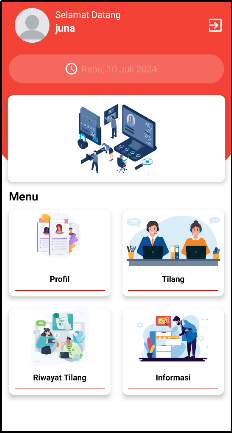

Etilang Website Management  
📖 Overview  
Welcome to the Etilang Website Management repository!  This project focuses on the management, development, and maintenance of the Etilang website, which is a crucial component of our Etilang application.  Please note that the application itself is managed in a separate repository.

 🚀 Feature  
Dynamic Content Management: Easily update and manage customer data, perform summaries, manage violation articles, users, payments, and more.

 📜 License  
This project is licensed under the JunaByte License.

 🤝 Contribution  
We welcome your contributions!  

 📞 Contact  
For inquiries or support, please reach out to me at iamjunaa@gmail.com.
